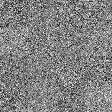

# DDPM
 Pytorch implementation pipeline for denoising defusion probabilistic models 

In-progress:

simple unet performance - still in progress
-   

- These are the results of only `3 days` learning of how DDPM works and how to implement it in pytorch 
- it's trained to predict FashionMNIST dataset from random noise
  

## Milestones
- [x] simple unet
- [x] training pipeline
- [ ] better performance
- [ ] attention based U-net
- [ ] better sampling pipeline